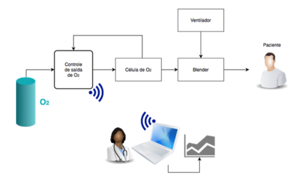
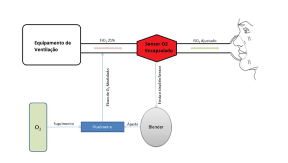
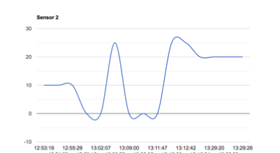

# Monitoring system using IoT

## Overview
- The main purpose of this project is to build a monitoring system using IoT for medical application. The application provides knowledge about my studies on `MySQL`, `Electronic Circuits`, `Google Charts`, `arduino` and `MD Boostrap`.

## Idea

  

## Working system

- 

  

## Results

- 

  

